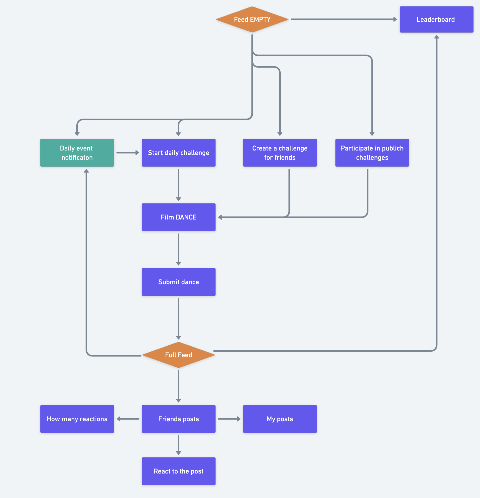

# VIDYLY

A social media platform, where users participate in daily physical activities, receive scores based on how good they replicate moves and compete with friends. 

AI fueled motion analysis.

**To sum it all up.** This isn't just an idea; it's a fully functional product. Experience it for yourself – Vidyly challenges you to give it a try! Let's get healthy together. 

## Problem statement

People are getting unhealthy rapidly. The health expenditure to GDP ratio in the OECD is 9.2%, while in the USA it is 16.6%. There is more spending on health issues than on preventing sickness. Both children and adults engage in sedentary activities, and consuming social media has become a convenient and habitual behavior. 

Childhood obesity is at all time high. There is a real global health crisis.

## Audience

- Target audience is 6-19 year olds
- Loves to consume short online content
- CENSIS report revealed 95% have smartphone access
- Enjoy playing and competing with friends

_Most popular TikTok user base 25% are 10-19 years olds._
_Snapchat has 19,7% users aged 13-17, and 18-24 taking a whooping 38.1%._

## Why Vidyly?

>A daily activity challenge app where users share videos, compete for accuracy and view friends' submissions.

- Stay motivated and compete with your friends.
- Participate in daily challenge
- Engage in physical activities before consuming content.
- Accessible: **all you need is a phone**.
- Promote natural movement.
- Enhance interaction with friends through daily challenges. Who is the best?
- Aim to be at the top of the leaderboard.

## Tech stack

`Node.js` backend written in `TypeScript`, compiled to Javascript for production. API served via `express`, keeping data in `MySQL`, connected via `Prisma ORM`, analyzed with `Python` and `OpenCV AI`. And of course used by clients on their phones with the help of `React Native`. Designs and flows kep in `Figma` and `Whimsical`. 

Simple, clean and with a lot of room for scalablilty.
## Demo

[Demo video](https://emp.lv/full2.mp4)

### Flowchart

https://whimsical.com/feed-9LVTMnPWcJzmv97tRinfJJ

## Dev notes

### Local setup

Local backend needs `node.js` and `MySQL`. That's it, well therethen there's the infinite `node_modules` hope, but meh - that's a broader topic.

**All local**

0. `cd backend` and have `MySQL` running
1. Install dependencies `npm i`
2. Copy and update variables in `cp example.env .env`
3. Update `Prisma client` to your machine with `npx prisma generate`
4. Run the migrations and seed `npx prisma migrate reset -y`
5. Finally build `npm run build` and serve with `npm run start`
6. Also do the setup the **analyzer** for real scores

**Docker**

0. `cd backend`
1. Run docker compose with `docker compose up -d`

### To test analyzer

1. Install `Python 3.12`, `opencv-python` & `mediapipe` libs. Needs to have `ffmpeg` and a few other things, that msot probably are already installed by default.
2. Check for media file paths at `./testpyvid.js`
3. Test the `python-in-node` execution with simple command `node testpyvid.js`
